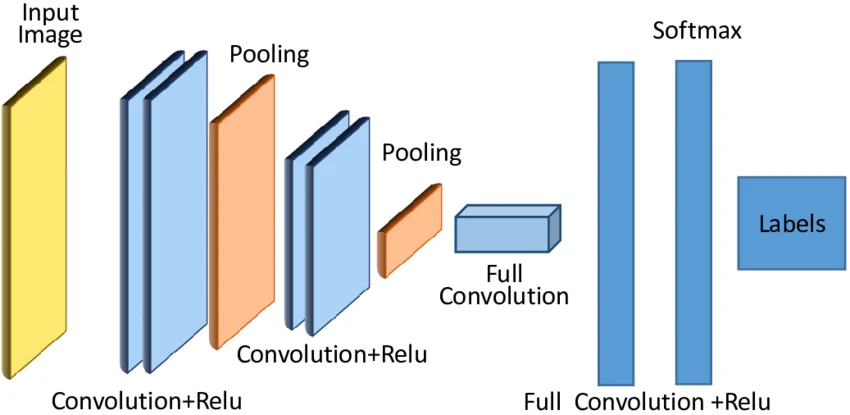

# Convolutional Neural Networks (CNN)

Welcome to the CNN Learning Portal.

This tutorial is designed for beginners who want to learn:

- Artificial Intelligence
- Machine Learning
- Deep Learning
- Neural Networks
- Convolutional Neural Networks

---

## Course Modules

### Module 1: Introduction to AI
- What is AI?
- Types of AI
- Applications of AI

### Module 2: Machine Learning
- Supervised Learning
- Unsupervised Learning
- Reinforcement Learning

### Module 3: Deep Learning
- Neural Networks
- Hidden Layers
- Activation Functions

### Module 4: Convolutional Neural Networks
- Convolution Layer
- Filters and Kernels
- Pooling Layer
- Fully Connected Layer

---

## Learning Outcomes

After completing this course, students will be able to:

- Understand CNN architecture
- Train image classification models
- Work with TensorFlow and Keras
- Build real-world image recognition projects

---

© 2026 Your Mewije Info Technics
